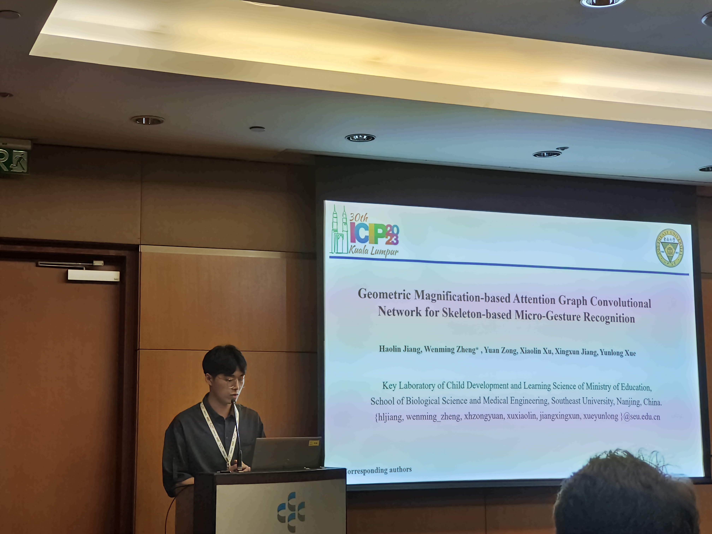
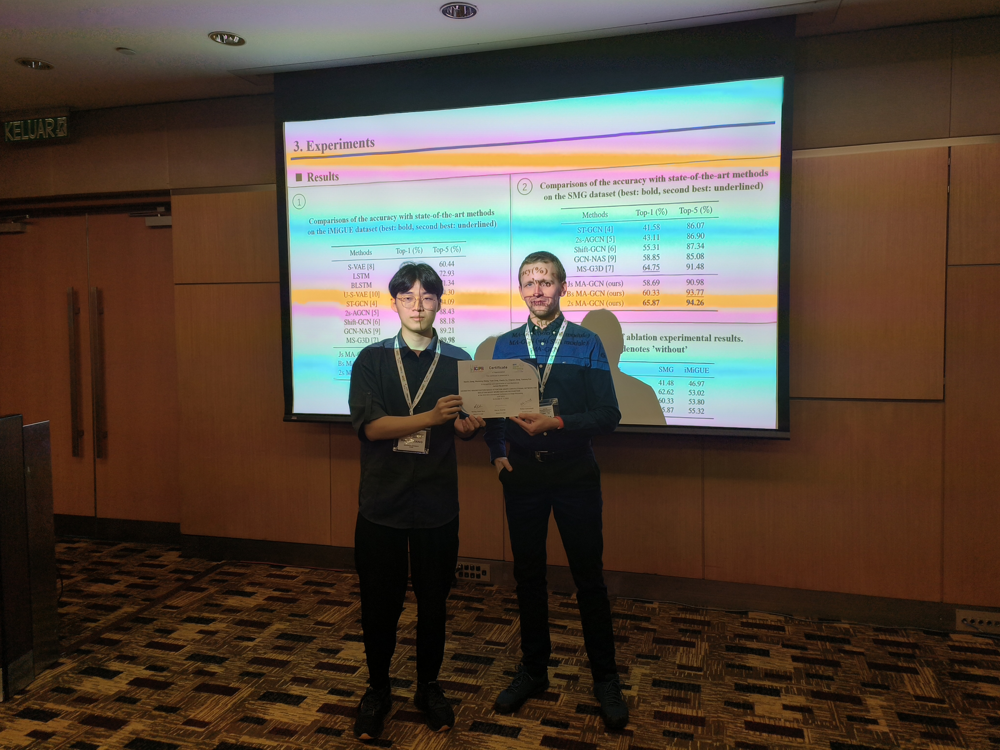

2023年10月7日至11日，赴马来西亚吉隆坡参加2023年ICIP国际学术会议(IEEE International Conference on Image Processing)，并做学术汇报，论文题目：Geometric Magnification-based Attention Graph Convolutional Network for Skeleton-based Micro-Gesture Recognition。

  

汇报现场

  

与session chair合影

